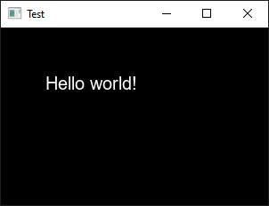

# tbaricault/graphics

[](LICENSE)


## Description

This is a C++23 library providing utilities for 2D rendering using OpenGL.

## Table of Contents

- [Description](#description)
- [Features](#features)
- [Requirements](#requirements)
- [Usage](#usage)
    - [Download and install](#download-and-install)
    - [Uninstall](#uninstall)
    - [CMake](#cmake)
    - [Include](#include)
    - [Environment](#environment)
- [Documentation](#documentation)
- [Examples](#examples)
    - [Simple text render](#simple-text-render)
- [License](#license)

## Features

- Texture class
- Renderer class that allows to draw on separated scenes
- Primitive drawing functions: rectangle, ellipse, text, texture

## Requirements

- C++23 or later
- CMake 3.20 or later
- [freetype/freetype](https://gitlab.com/freetype/freetype)
- [nigels-com/glew](https://github.com/nigels-com/glew)
- [tbaricault/colors](https://github.com/Thomas-Baricault/tbaricault_colors)
- [tbaricault/images](https://github.com/Thomas-Baricault/tbaricault_images)
- [tbaricault/math](https://github.com/Thomas-Baricault/tbaricault_math)
- [tbaricault/str](https://github.com/Thomas-Baricault/tbaricault_str)

## Usage

### Download and install

```bash
git clone https://github.com/Thomas-Baricault/tbaricault_graphics.git
cd tbaricault_graphics
make install
```

### Uninstall

```bash
make uninstall
```

### CMake

Add the library to your project:

```cmake
find_package(tbaricault_graphics REQUIRED)

target_link_libraries(
    my_target
    PRIVATE
        tbaricault::graphics
)
```

### Include

```cpp
#include <tbaricault/graphics.hpp>
```

### Environment

If you have a custom C++ installation, you can edit the `ENV` variable in the `Makefile` to specify your environment path.

Example on Windows with MSYS2/MinGW64:

```makefile
ENV = C:/msys64/mingw64
```

## Documentation

Read the complete documentation at [https://docs.thomas-baricault.fr/graphics](https://docs.thomas-baricault.fr/graphics).

## Examples

### Simple text render

```cpp
#include <iostream>
#include <tbaricault/glfwwrapper.hpp>
#include <tbaricault/graphics.hpp>


class Window
    : public tbaricault::glfwwrapper::Window
{

    public:

        tbaricault::graphics::Renderer renderer;
        tbaricault::graphics::Font font;


        Window()
            : tbaricault::glfwwrapper::Window("Test", {300, 200})
            , font("arial.ttf")
        {
            if (!this->font)
            {
                std::cout << "Font not found" << std::endl;
                this->close();
            }
            return;
        }

        virtual bool render() override
        {
            tbaricault::glfwwrapper::Window::render();

            this->renderer.resize(this->getContentSize());

            this->renderer.drawText(
                {50, 50},
                "Hello world!",
                this->font,
                20,
                0xffffffff
            );

            this->renderer.drawToWindow(
                this->getContentSize(),
                this->getContentSize()
            );

            return (true);
        }

};


int main()
{
    tbaricault::glfwwrapper::init();
    tbaricault::graphics::init();

    // Window have to be destroyed before cleanup
    {
        Window w;
        while (w)
        {
            tbaricault::glfwwrapper::pollEvents();
            w.update();
        }
    }

    tbaricault::graphics::cleanup();
    tbaricault::glfwwrapper::cleanup();

    return (0);
}
```

Output:



## Roadmap

- Return glyphs as reference and create an invalid glyph constant

## License

This project is licensed under the MIT License.

See [LICENSE](LICENSE) for details.
